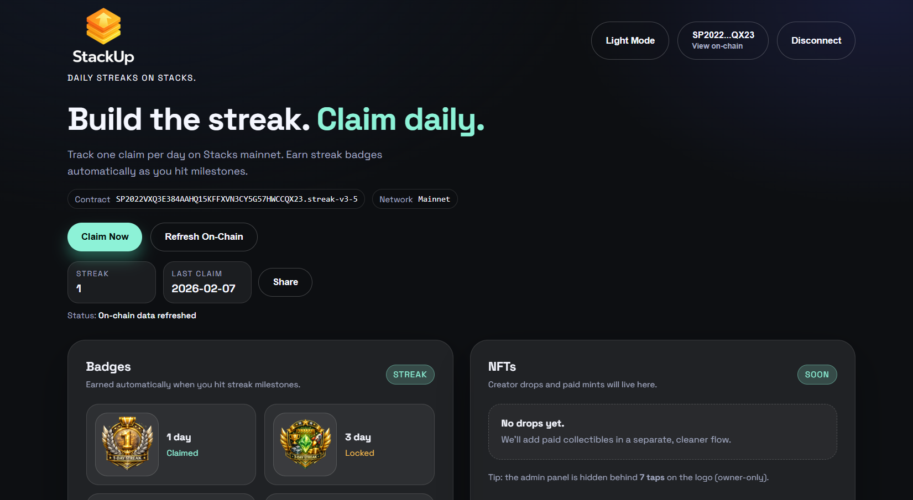

# StackUp



StackUp is a Stacks dApp for building daily momentum: claim once per day, grow your streak, and unlock on-chain badge NFTs at milestone days.

**What You Get**
- Leather wallet connect
- One-tap daily `claim` transaction
- On-chain reads: current streak, last claim day, owned badges
- Milestone badge gallery (1 / 3 / 7 / 14 / 30 by default)
- Owner-only admin panel for milestones + metadata URIs

## Live Contract (Mainnet)
Default app target:
- `SP2022VXQ3E384AAHQ15KFFXVN3CY5G57HWCCQX23.streak-v3-5`

## How Badges Work
Badge NFTs are minted automatically by the contract when a streak milestone is reached.

Badge art lives off-chain (IPFS) and is referenced by an on-chain token URI.
- Upload PNG + metadata JSON to IPFS (Pinata is fine).
- Set the URI on-chain via the admin function `set-badge-uri(kind, uri)`.
- When a user hits that milestone, the contract mints the NFT and the wallet/explorer can resolve the token URI.

Metadata templates:
- `metadata/`

## Smart Contracts
Stacks contracts are immutable. This repo keeps versioned contract files so you can deploy a new name when you iterate.

Current contract (recommended):
- `contracts/streak-v3-5.clar`

History:
- `contracts/streak.clar` (v1): streak + 7-day badge
- `contracts/streak-v3.clar`: configurable badge milestones + token URIs
- `contracts/streak-v3-1.clar`: redeploy name variant
- `contracts/streak-v3-2.clar`: auto-mint 1-day badge on first claim (if `u1` URI is configured)
- `contracts/streak-v3-3.clar`: admin-configurable milestones + optional paid mint (fees collected by contract)
- `contracts/streak-v3-4.clar`: paid mint fees routed directly to a configurable `fee-recipient`
- `contracts/streak-v3-5.clar`: per-kind mint fees (fallback to global fee)

If a contract name is already taken on a network, deploy the next versioned name and point the frontend at it via env vars.

## Contract Surface (High-Level)
Read-only:
- `get-streak(user)`
- `get-last-claim-day(user)`
- `get-owner(token-id)` and `get-token-uri(token-id)` (SIP-009-style)

User actions:
- `claim` (once per day, on-chain)

Owner/admin actions:
- `set-badge-uri(kind, uri)` (sets IPFS metadata URI for a badge kind)
- `set-milestones(list-of-kinds)` (configures which streak days mint badges automatically)
- `set-fee-recipient(principal)` (where paid mint fees are routed)
- `set-mint-fee(microstx)` and `set-mint-fee-kind(kind, microstx)` (configures paid mint pricing)
- `mint-paid-kind(kind)` (paid mint path, when enabled/configured)

## Frontend Config
Set these as Cloudflare Pages environment variables (or in a local `.env` file):
- `NEXT_PUBLIC_STACKS_NETWORK`: `mainnet` or `testnet`
- `NEXT_PUBLIC_CONTRACT_ADDRESS`: `SP...` (mainnet) or `ST...` (testnet)
- `NEXT_PUBLIC_CONTRACT_NAME`: e.g. `streak-v3-5`
- `NEXT_PUBLIC_SITE_URL`: your deployed site URL (used for absolute OG/Twitter tags)

If not set, the app falls back to defaults in `app/ClientPage.tsx`.

## Local Development
```bash
npm install
npm run dev
```

Open `http://localhost:3000`.

Quality checks:
```bash
npm run lint
npm test
npm run build
```

## Deploy (Cloudflare Pages)
This app is configured for static export (`next.config.ts` sets `output: "export"`).
- Build command: `npm run build`
- Build output directory: `out`

## Share Preview (Open Graph)
The share card image is `public/og.png` (1200x630). Regenerate it with:
```bash
node scripts/gen-og.mjs
```

## Brand Assets
- Logos: `public/logo/`
- Icons: `public/icons/`
- Badge images: `public/badges/`
